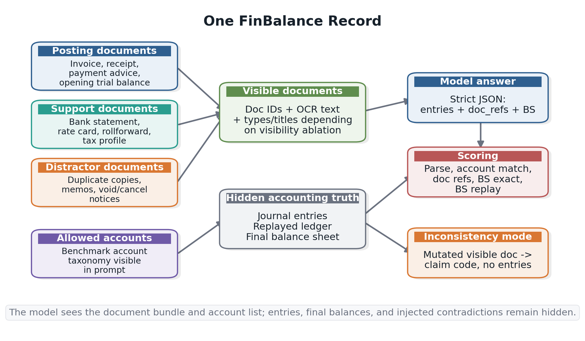
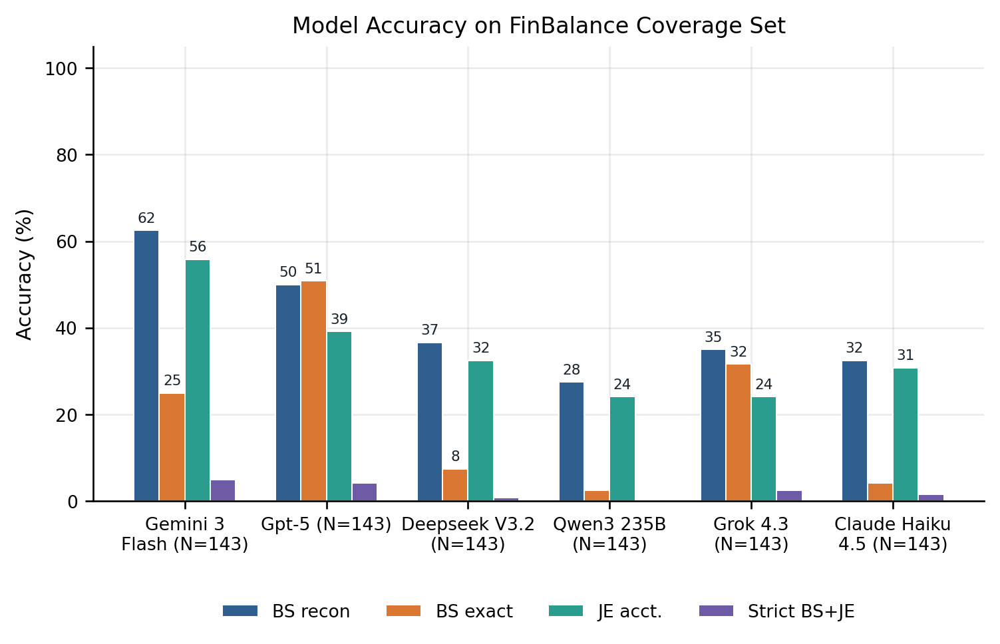
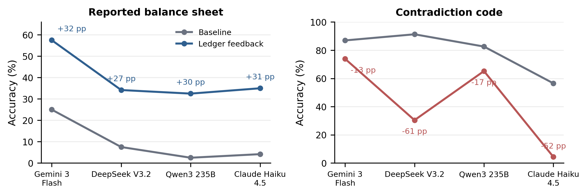
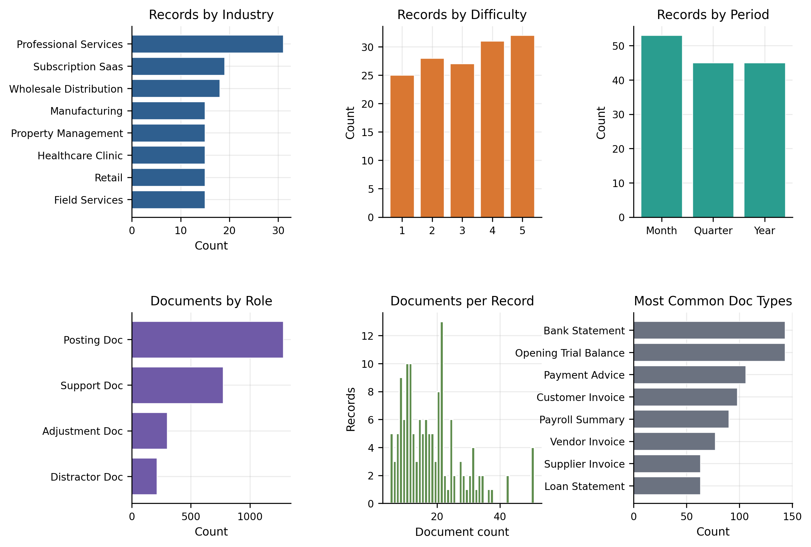

# FinBalance

**FinBalance** is a benchmark for document-grounded accounting reconciliation.
Each record is a source-document bundle with OCR text, and the model must
produce:

- balanced journal entries with supporting `doc_refs`
- the final balance sheet
- an inconsistency flag/code when the visible documents contradict each other

The core idea is simple: real accounting does not start from a finished
financial statement. It starts from source documents such as invoices, bank
statements, payment notices, contracts, schedules, tax certificates, and
distractor paperwork. FinBalance asks models to reconstruct the accounting
state from that document bundle.



## Paper Summary

Existing financial-NLP benchmarks mostly evaluate reasoning over prepared
artifacts: filings, tables, reports, or already-structured statements.
FinBalance moves one step earlier. The model receives a bundle of source
documents and must construct the cited double-entry ledger and final balance
sheet.

The dataset is synthetic in the controlled-benchmark sense. Humans author the
business scenarios, document schemas, chart of accounts, accounting policies,
tax/FX assumptions, support-document dependencies, distractor templates, and
inconsistency templates. The generator then samples dates and values, renders
OCR-style documents, and replays a deterministic double-entry ledger to compute
the ground truth. This makes every label auditable and reproducible.

Headline findings from the EMNLP 2026 submission:

- The benchmark was expert-validated through a 75-record review with an
  independently double-reviewed subset, plus a certified-accountant review of
  all 143 compact coverage records so every compact scenario is checked at
  least once.
- Across the six contemporary LLMs in our evaluation panel, the
  highest model reaches **46%** exact final balance-sheet accuracy on standard
  records.
- Four of six models show a **26-41 percentage-point aggregation gap**:
  replaying their own account-and-amount postings often gives a better balance
  sheet than the one they report.
- Document grounding is a separate failure mode: **52%** of entries with the
  right account and amount cite the wrong supporting documents.
- Explicit citation-pressure prompting barely moves that doc-ref failure, while
  evidence-only oracle retrieval helps substantially.
- A forced ledger-feedback diagnostic improves reported balance-sheet accuracy
  by **+25 to +36 pp**, while revealing an inconsistency-detection trade-off.





## What Is in a Record?

A FinBalance record contains:

- document metadata and OCR text
- rendered PDF-style document assets
- opening trial balance
- allowed account taxonomy
- expected journal entries
- expected final balance sheet
- inconsistency labels for negative-control records
- metadata such as industry, period type, difficulty, document roles, and
  concept flags

The benchmark covers eight industries, three period types, five difficulty
levels, multi-document support evidence, distractor documents, tax and
jurisdiction settings, foreign exchange, ASC 606-style revenue schedules,
leases, deferred tax, asset disposals, subledgers, and 23 contradiction codes.



## Install

`uv` is recommended:

```bash
uv sync
```

You can also install the package in editable mode:

```bash
python -m pip install -e .
```

## Generate Your Own Dataset

The release is not just a fixed dataset. Users can generate fresh datasets with
the public CLI or the Python API. This is useful for training splits, stress
tests, concept-targeted probes, new held-out document bundles, and larger evaluation
sets.

Commands below assume they are run from the repository root.

### CLI: exact record count

```bash
python scripts/generate_dataset.py \
  --output-dir data/custom_retail_saas \
  --dataset-name retail_saas_l2_l4 \
  --records 50 \
  --industries retail subscription_saas \
  --period-types month quarter \
  --levels 2 3 4 \
  --negative-control-rate 0.10 \
  --seed 42
```

### CLI: balanced cells

Use `--records-per-combo` to generate the same number of records for every
selected `industry x period_type x difficulty` cell:

```bash
python scripts/generate_dataset.py \
  --output-dir data/custom_balanced \
  --dataset-name balanced_small \
  --records-per-combo 2 \
  --industries professional_services manufacturing wholesale_distribution \
  --period-types month year \
  --levels 3 4 5 \
  --clean-only \
  --seed 7
```

Each generated bundle contains:

- `records.jsonl`
- `assets/`
- `record_manifest.jsonl`
- `manifest.json`
- `README.md`

### Python API

```python
from finbalance.generation.user_dataset import (
    UserDatasetConfig,
    generate_user_dataset,
)

summary = generate_user_dataset(
    UserDatasetConfig(
        output_dir="data/custom_api",
        dataset_name="custom_api",
        records=100,
        industries=("retail", "subscription_saas"),
        period_types=("month", "quarter"),
        levels=(2, 3, 4),
        negative_control_rate=0.10,
        seed=42,
        overwrite=True,
    )
)

print(summary)
```

### Regenerate the paper splits

```bash
python scripts/generate_standard_datasets.py \
  --base-dir data \
  --seed 42 \
  --records-per-combo 4 \
  --negative-controls-per-code 10 \
  --overwrite
```

## Dataset Splits

The canonical generated splits live under `data/`:

| Split | Records | Purpose |
|---|---:|---|
| `data/coverage/` | 143 | Compact ablation and smoke-test split |
| `data/main/` | 710 | Core paper evaluation split with four records per industry-period-difficulty cell and ten records per inconsistency code |

The folder names are kept for backward compatibility with earlier scripts and
result directories. The paper treats `main/` as the core evaluation split;
`coverage/` remains useful for fast ablations because it covers every
industry-period-difficulty cell and every inconsistency code at least once.

## Evaluate Models

Run a small OpenRouter ablation pilot:

```bash
export OPENROUTER_API_KEY=...

python -m finbalance evaluate-ablations \
  --dataset data/coverage/records.jsonl \
  --model google/gemini-3-flash-preview \
  --ablations prompt_baseline forced_ledger_verifier \
  --max-records 15 \
  --output-dir results/pilot \
  --checkpoint-every 5 \
  --resume
```

Analyze ablations with paired bootstrap:

```bash
python -m finbalance analyze-ablations \
  --results-dir results/pilot \
  --baseline prompt_baseline \
  --iterations 5000
```

Preview the prompt for one record:

```bash
python -m finbalance prompt-preview \
  --dataset data/coverage/records.jsonl \
  --max-records 1
```

Regenerate paper figures:

```bash
python scripts/generate_paper_figures.py \
  --dataset data/main/records.jsonl \
  --results-dir results \
  --output-dir paper/figures
```

## Reproducing the Headline Experiments

The paper reports:

- six-model baseline evaluation on the 710-record core split
- full ablation matrix on Gemini 3 Flash
- targeted ablations on DeepSeek, Claude Haiku 4.5, and Qwen 3 235B
- paired bootstrap CIs with 5,000 resamples

The headline OpenRouter request slugs were:

| Paper name | Request slug | Returned model in saved payloads |
|---|---|---|
| Gemini 3 Flash | `google/gemini-3-flash-preview` | `google/gemini-3-flash-preview-20251217` |
| GPT-5 | `openai/gpt-5` with `--reasoning-effort low` | `openai/gpt-5-2025-08-07` |
| Claude Haiku 4.5 | `anthropic/claude-haiku-4.5` | `anthropic/claude-4.5-haiku-20251001` |
| Grok-4.3 | `x-ai/grok-4.3` | `x-ai/grok-4.3-20260430` |
| DeepSeek Chat | `deepseek-chat` through DeepSeek Platform | `deepseek-chat` |
| Qwen 3 235B | `qwen/qwen3-235b-a22b-2507` | `qwen/qwen3-235b-a22b-07-25` |

Saved evaluation outputs include timestamps, selected provider, returned model
ID, raw response text, response metadata where provider terms permit, token
counts, cost, latency, parse status, tool/diagnostic metadata, and per-record
metrics.

## Repository Layout

| Path | Contents |
|---|---|
| `finbalance/` | Generator, ledger, schema definitions, evaluator, ablation runner, metrics, bootstrap |
| `scripts/` | User-facing generation, figure, and utility scripts |
| `data/` | Generated dataset splits and data release notes |
| `results/` | Model outputs from evaluation and ablation runs, gitignored by default |
| `human_verification/` | Expert validation records and protocol |
| `paper/` | EMNLP 2026 paper source, tables, bibliography, and figures |
| `POINTS.md` | Paper-ready result notes and analysis |
| `_archive/` | Legacy FinBalance v1 material |

## Package Map

| Module | Purpose |
|---|---|
| `finbalance/generation/` | Record and dataset generation, including the public `generate_user_dataset` API |
| `finbalance/doc_schemas/` | OCR-visible document schemas |
| `finbalance/industry_schemas/` | Industry-specific scenario plans and account behavior |
| `finbalance/ledger.py` | Deterministic double-entry ledger replay |
| `finbalance/validation/` | Record and document consistency checks |
| `finbalance/benchmark/` | Prompting, parsing, scoring, model runs, ablations, bootstrap |
| `finbalance/figures/` | Paper figure data extraction and plotting |

## Citation

A preprint is available on arXiv. If you use FinBalance, please cite:

```bibtex
@article{finbalance2026,
  title   = {FinBalance: A Multi-Document Accounting Reconciliation Benchmark},
  author  = {TODO: author list},
  journal = {arXiv preprint arXiv:TODO},
  year    = {2026},
  url     = {https://arxiv.org/abs/TODO}
}
```

## License

Source code, scripts, tests, and evaluation utilities are released under
Apache-2.0. See [`LICENSE`](LICENSE).

Generated benchmark records, OCR text, generated document artifacts, labels,
sample manifests, and human-verification records are released under CC BY 4.0.
See [`DATA_LICENSE.md`](DATA_LICENSE.md).

Raw model outputs and non-secret response metadata from paper runs may be
released as reproducibility artifacts, separate from the dataset license and
subject to provider terms. API keys, billing logs, and restricted provider
fields are excluded or redacted. Users who rerun evaluations are responsible
for complying with their model/API provider terms.
